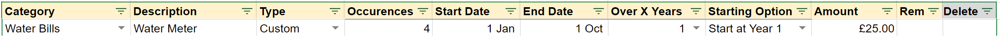

# Example 1: Easy

For this example we shall create a budget entry of £25 that occurs every 3 months. This will happen every single year.

### How To Do It

We enter some information in the <mark style="color:blue;">Category</mark> and <mark style="color:blue;">Description</mark> and column. We shall choose _Spending_ in the <mark style="color:blue;">Type</mark> column.

1. In the <mark style="color:blue;">Occurrences</mark> column we enter 4. This is the number of times that this item will happen between the dates we are about to enter
2. In the <mark style="color:blue;">Start Date</mark> column we enter _1 Jan 2020_ (I could have picked any year). This means the first payment of £50 will be expected in January&#x20;
3. In the <mark style="color:blue;">End Date</mark> column we enter _1 Oct 2020_ (I could have picked any year). This means the last payment of £50 will be expected in October
4. In the <mark style="color:blue;">Over X Years</mark> column we enter _1_ because we want this pattern to repeat every (1) year
5. In the <mark style="color:blue;">Starting Option</mark> column we enter _Start at Year 1_ because it's happening every year so of course it'll need to start on year 1, it's the only year there is before it repeats.
6. In the <mark style="color:blue;">Amount</mark> column we enter _£25_ which is the amount for each instance

<em>Tip: You can actually skip an item and just leave it blank</em>

The default <mark style="color:blue;">Starting Option</mark> is _Start at Year 1_ so you are free to leave this blank and it'll assume you want _Start at Year 1_

### How it Looks in the Spreadsheet

### The Schedule

Every Year:\
_January, April, July, October_

####
